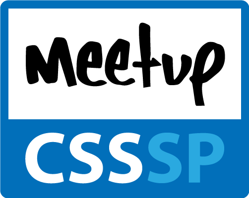

======

* [Apresentação do Meetup](https://speakerdeck.com/raphaelfabeni/bem-vindos-ao-meetp-css)
* [Meetups já realizados](meetups.md)

_"De todos para todos!"_ Essa é idéia do [Meetup CSS](http://www.meetup.com/CSS-Brasil/) que surgiu da idéia de podermos trocar conhecimentos, aprender coisas novas e claro, conhecer novos profissionais e fortalecer a comunidade. É organizado atualmente por mim ([Raphael Fabeni](https://twitter.com/raphaelfabeni)) e pelo [Felipe Fialho](https://twitter.com/LFeh).
A idéia do repositório é reunir as principais informações, como links, fotos e palestras, sobre os meetups.

* [Meetups](meetups.md)
* [Locais](#locais)
* [Como participo?](#como-participo)
* [Quero palestrar!](#quero-palestrar)

## Locais

Se você estiver disposto a nos ajudar com locais para os _meetups_ fique a vontade. :v: Não existe um padrão definido, mas acreditamos que para o _meetup_ ficar bacana, o local precisa:

* Ter suporte para pelo menos dez pessoas.
* Caso o _meetup_  esteja programado com palestras, ter suporte para isso, como um projetor e se for preciso microfone.

Animou? Envie um e-mail pra gente _rapha.fabeni@gmail.com_ e _hi@felipefialho.com_.

### E o coffee?

Não é obrigatório. Algumas empresas que cedem o espaço geralmente cedem algo, mas não é padrão. Se o local oferecer, ótimo; senão, os organizadores e a pessoa que sugeriu o local, podem organizar algo mais simples ou até mesmo, por meio de um aviso prévio, pedir uma ajuda simbólica para os partipantes do _meetup_ para ajuda nos custos. No entanto, o que gostamos de deixar claro é que o *coffee* tem que ser algo secundário em relação ao encontro e não ser a coisa principal.

## Como participo?

Se cadastre no site do [Meetup](http://www.meetup.com/) e se inscreva no [Meetup CSS](http://www.meetup.com/CSS-Brasil/). Lá estaremos divulgando as informações referentes aos próximos _meetups_.

## Quero palestrar!

Tem vontade de apresentar uma talk? Maravilha. [Envie algumas informações pra gente através desse link](https://docs.google.com/forms/d/1PMHgyHBhlcXkRbrff4CRheIoFVp7solcjhnUTDKe7Y4/viewform) e assim que tivermos o próximo _meetup_ confirmado, iremos separar todas as respostas e organizarmos de acordo com os assuntos escolhidos.

## Como começamos

Achou tudo uma loucura? Gostou? Quer tentar aplicar em outro local? Escrevemos um pequeno texto relacionado a [como iniciamos o projeto](inicio.md).

## Agradecimentos

### Logo

O logo foi desenvolvido pelo [Fernando Capeto](http://fernandocapeto.com/) e gostariamos de deixar registrado o nosso agradecimento pela contribuição.

### Empresas parceiras

Quem já nos ajudou :facepunch:

* [Caelum](https://www.caelum.com.br/)
* [Digital Garden](http://www.webcitizen.com.br/)
* [iMasters](http://imasters.com.br/)
* [Lambda3](http://lambda3.com.br/)
* [PayPal](https://www.paypal-brasil.com.br/desenvolvedores/)
* [Scup](http://www.scup.com/pt/)
